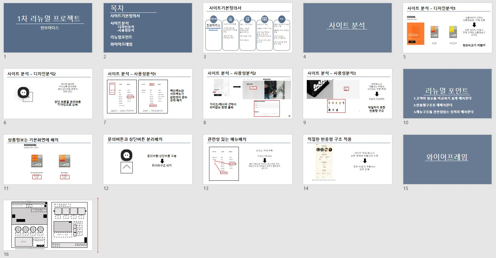

# 빈브라더스 리뉴얼

리뉴얼 대상 사이트 : [빈브라더스](https://beanbrothers.co.kr/, "beanbrothers link")

### 프로젝트소개

개발기간 : 2023.11.13~2023.12.1

개발환경:
Visual Studio Code을 이용하여 개발되었고 시안은 figama을 사용했습니다

고민사항 및 해결과정

1. 고객이 정보를 비교하기 쉽게 배치
2. 반응형 구조로 재배치
3. 메뉴를 관련성있게 재구성
4. 커피추출법 페이지를 정리된 형식으로 작성

데모사이트 : [빈브라더스 리뉴얼 사이트](https://heosure.github.io/beanbrothers_renewal/ ,"beanbrothers renewal")

피그마링크 :
[빈브라더스 리뉴얼 피그마](https://www.figma.com/file/cdvJBOSvainoyN0jzGUgUG/%EB%A6%AC%EB%89%B4%EC%96%BC%ED%94%84%EB%A1%9C%EC%A0%9D%ED%8A%B8_%EB%B9%88%EB%B8%8C%EB%9D%BC%EB%8D%94%EC%8A%A4?type=design&node-id=0-1&mode=design&t=rcmHZ5bg9dgadBgs-0, "figama")

약식기획서 :
[빈브라더스 리뉴얼 ppt](https://docs.google.com/presentation/d/1mmbhHTlhAkn1OA2rYvQ7IR6lPAshM4JU/edit#slide=id.p1, "google pptx")

